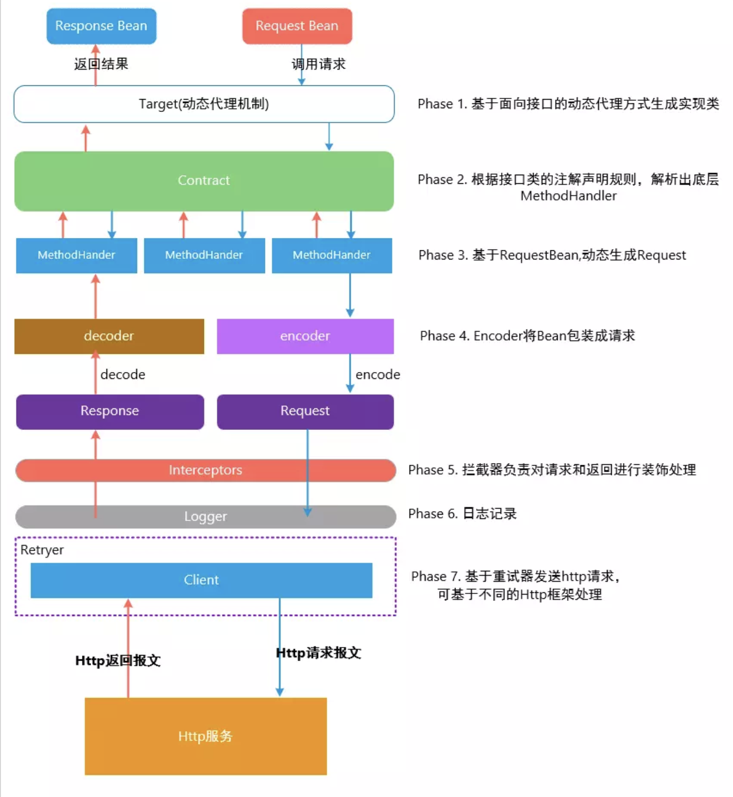

# springCloud:
 ## 1.bootstrap.yml（bootstrap.properties）与application.yml（application.properties）执行顺序
  ### bootstrap.yml（bootstrap.properties）用来程序引导时执行，应用于更加早期配置信息读取，如可以使用来配置application.yml中使用到参数等
  ### application.yml（application.properties) 应用程序特有配置信息，可以用来配置后续各个模块中需使用的公共参数等。
  ### bootstrap.yml 先于 application.yml 加载
  #### 应用场景 ：
    - 1.当使用 Spring Cloud Config Server的时候，你应该在 bootstrap.yml里面指定 spring.application.name和 spring.cloud.config.server.git.uri
    - 2.一些加密/解密的信息

# ribbon：客户端负载均衡（软负载均衡）
 ## 调用链路选择服务器逻辑
  ### LoadBalancerClient（RibbonLoadBalancerClient） -> ILoadBalancer（ZoneAwareLoadBalancer） -> IRule (ZoneAvoidanceRule)
   #### LoadBalancerClient:
   - 转化URI，将含应用名称URI转化成具体主机+端口形式
   - 选择服务实例，通过负载算法，选择指定服务中的一台机器实例
   - 请求执行回调，针对选择后的服务实例，执行具体的请求回调操作
   - 默认实现：RibbonLoadBalancerClient
   #### LoadBalancerContext:
        转化URI，将含应用名称URI转化成具体主机+端口形式
        组件关联，关联RetryHandler、ILoadBalancer等
        记录服务统计信息，记录请求时间、错误数量等
        默认实现：RibbonLoadBalancerContext
      ILoadBalancer:
        增加服务器
        获取服务器：通过关联Key获取、获取所有服务列表、获取可用服务器列表
        服务器状态：标记服务器宕机
        默认实现：ZoneAwareLoadBalancer
      IRule
        选择服务器，根据负载均衡器以及关联Key获取候选的服务器
        默认实现：ZoneAvoidanceRule
      IPing：
        活动检测，根据指定的服务器，检测其是否活动
        默认实现：DummyPing
      ServerList：
        获取初始化服务器列表
        获取更新服务器列表
        默认实现：ConfigurationBasedServerList或DiscoveryEnabledNIWSServerList

    负载均衡器：
      ILoadBalancer
        BaseLoadBalancer
        DynamicServerListLoadBalancer
        ZoneAwareLoadBalancer
        NoOpLoadBalancer
    负载均衡规则接口
      IRule：
        随机规则：RandomRule
        最可用规则：BestAvailableRule
        轮训规则：RoundRobinRule
        重试实现：RetryRule
        客户端配置：ClientConfigEnabledRoundRobinRule
        可用性过滤规则：AvailabilityFilteringRule
        RT权重规则：WeightedResponseTimeRule
        规避区域规则：ZoneAvoidanceRule
    ping策略
      IPingStrategy
        NoOpPing
        DummyPing
        PingConstant
        PingUrl
        NIWSDiscoveryPing

    轮询算法：第几次请求 % 集群中该服务实例总数 = 实际调用服务实例下标，每次重启按1计算。

    使用RestTemplate访问微服务需要加入

    ```java
      @LoadBalance
      @Bean
      public RestTemplate restTemplate(){
        return new RestTemplate();
      }
    ```

  Hystrix：
    初始化顺序： @EnableCiruitBreaker -> EnableCircuitBreakerImportSelector -> HystrixCircuitBreakerConfiguration
    HystrixCircuitBreakerConfiguration
      自动装配Hystrix组件: 
          Hystrix命令切面: HystrixCommandAspect
          Hystrix Endpoint: HystrixStreamEndpoint
          Hystrix指标: HystrixMetricsPollerConfiguration
    HystrixCommandAspect
      拦截标注@HystrixCommand或@HystrixCollapser的方法(@Aroud)
      生成拦截方法原信息(MetaHolderFactory)
      生成HystrixInvokable(HystrixCommandFactory)
      选择执行模式(Observable或非Observable)
    SpringFactoryImportSelector
      选择/META-INF/spring.factories中注解类型（泛型）,所配置的SpringConfiguration类
        EnableCircuitBreakerImportSelector、EnableDiscoveryClientImportSelector

    使用@EnableHystrix 启用Hystrix(注意：@EnableHystrix注解包含@EnableCircuitBreaker注解)

    1.@DefaultProperties(defaultFallback = "fallback")+@HystrixCommand 提供公用的降级处理
    2.@HystrixCommand单个方法配置
    3.feign中@FeignClient(name = "service_id",fallback = xxxFallback.class)实现业务接口提供降级处理
    4.feign中@FeignClient(name = "service_id",fallbackFactory=xxxFactory.classs)实现FallbackFactory接口提供降级处理


    ```java
      注意：@HystrixCommand不能用在feign接口中，feign接口配置降级处理需要通过@FeignClient(name = "service_id", fallback = xxxFallback.class,fallbackFactory=xxxFactory.classs)[fallback与fallbackFactory任选一个],并且实现该业务接口或实现FallbackFactory，相关降级策略需要在yml配置。

      @HystrixCommand(
           //Command 配置
            commandProperties = { 
                    // 设置操作时间为 100 毫秒
                    @HystrixProperty(name = "execution.isolation.thread.timeoutInMilliseconds", value = "100")
            },fallbackMethod = "fallbackForGetUsers" //设置 fallback 方法
    )
    public Collection<User> getUsers() throws InterruptedException {
        long executeTime = random.nextInt(200);
        // 通过休眠来模拟执行时间
        System.out.println("Execute Time : " + executeTime + " ms");
        Thread.sleep(executeTime);
        return userService.findAll();
    }
    /**
     * {@link #getUsers()} 的 fallback 方法
     */
    public Collection<User> fallbackForGetUsers() {
        return Collections.emptyList();
    }

    HystrixCommand与HystrixObservableCommand区别：
      HystrixCommand用在依赖服务返回单个操作结果的时候。有两种执行方式
　　    - execute():同步执行。从依赖的服务返回一个单一的结果对象，或是在发生错误的时候抛出异常。
　　    - queue():异步执行。直接返回一个Future对象，其中包含了服务执行结束时要返回的单一结果对象。
　　  HystrixObservableCommand用在依赖服务返回多个操作结果的时候。它也实现了两种执行方式
　　    - observe():返回Obervable对象，他代表了操作的多个结果，他是一个HotObservable
　　    - toObservable():同样返回Observable对象，也代表了操作多个结果，但它返回的是一个Cold Observable。

  当一个服务调用另一个服务由于网络原因或自身原因出现问题，调用者就会等待被调用者的响应 当更多的服务请求到这些资源导致更多的请求等待，发生连锁效应（雪崩效应）
  断路器有完全打开状态:一段时间内 达到一定的次数无法调用 并且多次监测没有恢复的迹象 断路器完全打开 那么下次请求就不会请求到该服务
  半开:短时间内 有恢复迹象 断路器会将部分请求发给该服务，正常调用时 断路器关闭
  关闭：当服务一直处于正常状态 能正常调用

  服务熔断就是相当于我们电闸的保险丝,一旦发生服务雪崩的,就会熔断整个服务,通过维护一个自己的线程池,当线程达到阈值的时候就启动服务降级,如果其他请求继续访问就直接返回fallback的默认值。
  熔断状态：打开、关闭、半开
  熔断器原理
    - 开始时断路器处于关闭状态(Closed)。
    - 如果调用持续出错、超时或失败率超过一定限制，断路器打开进入熔断状态，后续一段时间内的所有请求都会被直接拒绝。
    -  一段时间以后，保护器会尝试进入半熔断状态(Half-Open)，允许少量请求进来尝试；如果调用仍然失败，则回到熔断状态，如果调用成功，则回到电路闭合状态;

  Hystrix整个工作流如下：
    1.构造一个 HystrixCommand或HystrixObservableCommand对象，用于封装请求，并在构造方法配置请求被执行需要的参数；
    2.执行命令，Hystrix提供了4种执行命令的方法：execute()和queue() 适用于HystrixCommand对象，而observe()和toObservable()适用于HystrixObservableCommand对象。
    3.判断是否使用缓存响应请求，若启用了缓存，且缓存可用，直接使用缓存响应请求。Hystrix支持请求缓存，但需要用户自定义启动；
    4.判断熔断器是否打开，如果打开，跳到第8步；
    5.判断线程池/队列/信号量是否已满，已满则跳到第8步；
    6.执行HystrixObservableCommand.construct()或HystrixCommand.run()，如果执行失败或者超时，跳到第8步；否则，跳到第9步；
    7.统计熔断器监控指标；
    8.走Fallback备用逻辑
    9.返回请求响应

  熔断器流程：
    Hystrix在运行过程中会向每个commandKey对应的熔断器报告成功、失败、超时和拒绝的状态，熔断器维护并统计这些数据，并根据这些统计信息来决策熔断开关是否打开。如果打开，熔断后续请求，快速返回。隔一段时间（默认是5s）之后熔断器尝试半开，放入一部分流量请求进来，相当于对依赖服务进行一次健康检查，如果请求成功，熔断器关闭。


  circuitBreaker.enable
    是否开启熔断器。
  circuitBreaker.errorThresholdPercentage：
    错误率，默认值50%，例如一段时间（10s）内有100个请求，其中有54个超时或者异常，那么这段时间内的错误率是54%，大于了默认值50%，这种情况下会触发熔断器打开。
  circuitBreaker.requestVolumeThreshold：
    默认值20。含义是一段时间内至少有20个请求才进行errorThresholdPercentage计算。比如一段时间了有19个请求，且这些请求全部失败了，错误率是100%，但熔断器不会打开，总请求数不满足20。
  circuitBreaker.sleepWindowInMilliseconds：
    半开状态试探睡眠时间，默认值5000ms。如：当熔断器开启5000ms之后，会尝试放过去一部分流量进行试探，确定依赖服务是否恢复。

  一定时间内请求次数达到次数，且错误率大于错误率，开启断路器。

   ```java

     /**
     * 熔断处理
     */
    @RequestMapping("/hystrix/{id}")
    @HystrixCommand(fallbackMethod = "fallback1", commandProperties = {
            @HystrixProperty(name = "circuitBreaker.enabled", value = "true"),//是否开启断路器
            @HystrixProperty(name = "circuitBreaker.requestVolumeThreshold", value = "2"),//请求次数
            @HystrixProperty(name = "circuitBreaker.sleepWindowInMilliseconds", value = "10000"),//时间窗口期
            @HystrixProperty(name = "circuitBreaker.errorThresholdPercentage", value = "60"),//失败率阀值跳闸
    })
    public Object hystrixTest(@PathVariable("id") String id) {
        if (Integer.parseInt(id) > 0) {
            throw new RuntimeException("id不能小于0");
        }
        return System.currentTimeMillis();
    }

    /**
     * 服务熔断方法
     */
    public Object fallback1(String id) {
        return "服务熔断";
    }

   ``` 


  zuull:
  两种启动方式：
    @EnableZuulServer
      DispatcherServlet
        ZuulHandlerMapping
          ZuulController
            ZuulServlet
              ZuulFilter
    @EnableZuulProxy
      DispatcherServlet
        ZuulHandlerMapping
          ZuulController
            ZuulServlet
              RibbonRoutingFilter

  功能：
    认证和安全 识别每个需要认证的资源，拒绝不符合要求的请求。
    性能监测 在服务边界追踪并统计数据，提供精确的生产视图。
    动态路由 根据需要将请求动态路由到后端集群。
    压力测试 逐渐增加对集群的流量以了解其性能。
    负载卸载 预先为每种类型的请求分配容量，当请求超过容量时自动丢弃。
    静态资源处理 直接在边界返回某些响应。

  Zuul1.0基于Servlet2.5阻塞I/O实现，不支持长连接。
  Zuul2.0较Zuul1.0有较大提升，不开源。
  GateWay基于Servelt3、WebFlux、netty异步非阻塞I/O，支持长连接,（netty运行时）不能在sservlet容器中使用，或war包运行。


  zuul路由配置：
  ```txt
    zuul:
      routes:
        route-name: #路由别名，无其他意义，与例1效果一致
          service-id: rest-demo
          path: /rest/**
    ```
  gateway三大功能：路由、断言、过滤（对请求前后进行修改拦截。）。
  1.客户端向Gateway发送请求，然后在Gateway HandleMapping中找到与请求相匹配的路由，将其转发到WebHandler。
  2.WebHandler再通过指定的过滤器链来将请求发送到实际的服务执行业务逻辑，然后返回。
  3.过滤器之间用虚线分开是因为过滤器可能会在发送代理请求之前（pre）或之后（post）执行业务逻辑。
  4.Filter在‘pre’类型的过滤器可以做参数校验、权限校验、流量监控、日志输出、协议转换等，
    在'post'类型的过滤器中可以做响应内容、响应头的修改、日志的输出、流量的监控等

  predicate（断言）：after、before、between、cookie、header、host、method、path、query、remoteaddr、weight
  filter分为：GatewayFilter、GlobalFilter（自定义过滤器）
    - GatewayFilter：包含对请求头、响应头、session、令牌桶过滤、熔断等处理
    - GlobalFilter：实现GlobalFilter, Ordered接口。支持sockjs、websocket
    - HTTP超时、跨域、tls/ssl


  eureka-server:
     1. 错误：  Instances currently registered with Eureka
      解决问题：
        ## Spring Cloud Eureka 服务器作为注册中心，通常情况下，不需要再注册到其他注册中心去，同时，它也不需要获取客户端信息
        ### 取消向注册中心注册
        eureka.client.register-with-eureka = false
        ### 取消向注册中心获取注册信息（服务、实例信息）
        eureka.client.fetch-registry = false
        ## 解决 Peer / 集群 连接问题
        eureka.instance.hostname = localhost
        eureka.client.serviceUrl.defaultZone = http://${eureka.instance.hostname}:${server.port}/eureka
    1. @EnableDiscoveryClient与@EnableEurekaClient区别
      注解@EnableEurekaClient上有@EnableDiscoveryClient注解，可以说基本就是@EnableEurekaClient有@EnableDiscoveryClient的功能，其实@EnableEurekaClient注解就是一种方便使用eureka的注解而已，可以说使用其他的注册中心后，都可以使用@EnableDiscoveryClient注解，但是使用@EnableEurekaClient的情景，就是在服务采用eureka作为注册中心的时候，使用场景较为单一。

    DiscoveryClient:获取eureka注册所有实例信息
    zookeeper做服务注册中心时，注册为临时节点，服务下线直接剔除。


    服务注册流程： 
      Eureka Client 的注册是由 Spring Cloud 的 AutoServiceRegistration 自动注册发起, 在设置应用实例 Instance 初始状态为 UP 时, 触发了 InstanceInfoReplicator#onDemandUpdate()按需更新方法, 将实例 Instance 信息通过 DiscoveryClient 注册到 Eureka Server, 期间经过了一些 EurekaHttpClient 的装饰类, 实现了诸如定期重连, 失败重试, 注册重定向, 统计收集 Metrics 信息等功能, 最后由 JerseryClient 发送 POST 请求调用 Eureka Server 的[/eureka/apps / 应用名] 端点, 请求体携带 InstanceInfo实例信息, 完成注册。在服务注册后，Eureka Client会维护一个心跳来持续通知Eureka Server，说明服务一直处于可用状态，防止被剔除。Eureka Client在默认的情况下会每隔30秒(eureka.instance.leaseRenewallIntervalInSeconds)发送一次心跳来进行服务续约。 Eureka Server之间会互相进行注册，构建Eureka Server集群，不同Eureka Server之间会进行服务同步，用来保证服务信息的一致性。
    服务调用流程：
      Eureka Client在刚启动的时候会从Eureka Server全量获取一次注册信息，同时初始化Eureka Client本地实例信息缓存定时更新任务，默认30s一次 registryFetchIntervalSeconds = 30。同时，为了性能考虑，Eureka Server也会维护一份只读的服务清单缓存，该缓存每隔30秒更新一次。 服务消费者在获取到服务清单后，就可以根据清单中的服务列表信息，查找到其他服务的地址，从而进行远程调用。Eureka有Region和Zone的概念，一个Region可以包含多个Zone，在进行服务调用时，优先访问处于同一个Zone中的服务提供者。
    服务下线流程：
      当Eureka Client需要关闭或重启时，就不希望在这个时间段内再有请求进来，所以，就需要提前先发送REST请求给Eureka Server，告诉Eureka Server自己要下线了，Eureka Server在收到请求后，就会把该服务状态置为下线（DOWN），并把该下线事件传播出去。 
    服务剔除：
      有时候，服务实例可能会因为网络故障等原因导致不能提供服务，而此时该实例也没有发送请求给Eureka Server来进行服务下线，所以，还需要有服务剔除的机制。Eureka Server在启动的时候会创建一个定时任务，每隔一段时间（默认60秒），从当前服务清单中把超时没有续约（默认90秒，eureka.instance.leaseExpirationDurationInSeconds）的服务剔除。
    自我保护：
      既然Eureka Server会定时剔除超时没有续约的服务，那就有可能出现一种场景，网络一段时间内发生了异常，所有的服务都没能够进行续约，Eureka Server就把所有的服务都剔除了，这样显然不太合理。所以，就有了自我保护机制，当短时间内，统计续约失败的比例，如果达到一定阈值（在 15 分钟之内是否低于 85%），则会触发自我保护的机制，在该机制下，Eureka Server不会剔除任何的微服务，等到正常后，再退出自我保护机制。自我保护开关(eureka.server.enable-self-preservation: false)


Eureka与Consul对比：
Consul强一致性(C)带来的是：（CA）
服务注册相比Eureka会稍慢一些。因为Consul的raft协议要求必须过半数的节点都写入成功才认为注册成功
Leader挂掉时，重新选举期间整个consul不可用。保证了强一致性但牺牲了可用性。

Eureka保证高可用(A)和最终一致性：（AP）
服务注册相对要快，因为不需要等注册信息replicate到其他节点，也不保证注册信息是否replicate成功
当数据出现不一致时，虽然A, B上的注册信息不完全相同，但每个Eureka节点依然能够正常对外提供服务，这会出现查询服务信息时如果请求A查不到，但请求B就能查到。如此保证了可用性但牺牲了一致性。
其他方面，eureka就是个servlet程序，跑在servlet容器中; Consul则是go编写而成。


feign（声明式HTTP客户端调用）: 以前是Resttemplate+负载均衡方式调用，每个服务都需要编写调用代码，耦合度高。feign集成了ribbon
    Decoder/Encoder: ResponseEntityDecoder/SpringEncoder
    Logger: slf4jLogger
    Contract: SpringMvcContract
    Feign.Builder: HystrixFeign.Builder
    client: LoadBalancerFeignClient (Ribbon 激活时)

Feign的整体工作流程
  扫描@EnableFeignClients注解中配置包路径。
  扫描@FeignClient注解，并将注解配置的信息注入到Spring容器中，类型为FeignClientFactoryBean。
  根据FeignClientFactoryBean的getObject()方法得到不同动态代理的类。
  根据不同的代理执行不同的invoke()方法。  

  


##springcloud-bus：消息总线

##springcloud-stream：屏蔽消息中间件差异，提供统一的消息编程模型。
  - binder：中间件绑定器
  - channel：消息存储
  - source：生产者或消费者
解决消息重复消费和持久化问题：将消费者放到同一个分组内.

 ##springcloud-nacos:支持服务注册发现和配置
  Namespace（命名空间）=（默认）public
  Group（分组）=（默认）DEFAULT_GROUP，把相同的group分组划分到同一个分钟
  cluster（集群）=DEFAULT
  data-id：${spring.application.name}-${spring.profiles.active}.yaml
  通过@RefreshScope动态刷新配置
