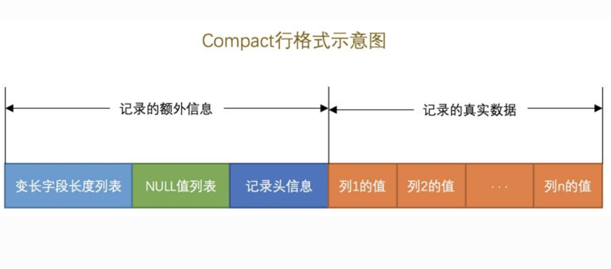

# mysql索引

#### 主键和唯一性约束的区别：
    1.列内容都不允许重复
    2.主键列不可以为null而唯一性约束可以
    3.一个表只能有一个主键，可以有多个唯一性约束

#### 一个表最多只能有一个自增列，自增列必须建立索引，可以设置unsigned属性，提升正数的表示规范。

#### 无符号（unsigned）和有符号（signed）的区别就是有符号类型需要使用一个bit来表示数字的正负，由于在计算机中,整数是以补码形式存放的。根据最高位的不同，如果是1,有符号数的话就是负数；如果是无符号数,则都解释为正数。

#### insert into ... on DUPLICATE key update column = value，如果有相同的记录，更新内容

#### 一条sql执行流程：客户端发送sql语句->查询缓存->SQL语句解析->查询优化->存储引擎->文件系统

#### 如果查询SQL语句中包含系统函数、存储函数、自定义变量、系统表就不会命中缓存

#### mysql会检测每张表，如果表结构或数据发生改变，与该表有关的缓存都会失效

#### Innodb将数据划分为若干个页，以页作为磁盘和内存之间交互的基本单位，Innodb中页的大小默认为16KB。 一次最少从磁盘中读16KB的数据到内存，一次最少将16KB的内容保存到磁盘。

#### mysql5.6Inndb引擎默认行格式compact，5.7默认Dynamic

#### 在Compact行格式中，把所有变长类型（varchar[16]）的列的长度都存放在记录的开头部位形成一个列表，按照列的顺序逆序存放,变长字段长度列表中只存储值为非NULL的列内容占用的长度，值为NULL的列的长度是不储存的(占用1-2个字节)

#### NULL值列表,表中的某些列可能存储NULL值，如果把这些NULL值都放到记录的真实数据中存储会很占地方，所以Compact行格式把这些值为NULL的列统一管理起来，存储到NULL值列表中,每个允许存储NULL的列对应一个二进制位，二进制位按照列的顺序逆序排列,二进制位的值为1时，代表该列的值为NULL,为0时，代表该列的值不为NULL。NULL值列表必须用整数个字节的位表示，如果使用的二进制位个数不是整数个字节，则在字节的高位补0(占用1个字节)

#### 记录头信息,由固定的5个字节组成。5个字节也就是40个二进制位，不同的位代表不同的意思

#### 记录的真实数据,除了我们插入的那些列的数据，MySQL会为每个记录默认的添加一些列（也称为隐藏列）,MySQL服务器会为每条记录都添加 transaction_id 和 roll_pointer 这两个列，但是 row_id 只有在表没有定义主键的时候才会为记录添加，相当于MySQL服务器帮我们来添加一个主键。如果某一列中的数据非常多的话，在本记录的真实数据处只会存储该列的前786个字节的数据和一个指向其他页的地址，然后把剩下的数据存放到其他页中，这个过程也叫做行溢出。

#### 行溢出临界点
    - MySQL中规定一个页中至少存放两行记录
    - 每个页除了存放我们的记录以外，也需要存储一些额外的信息，乱七八糟的额外信息加起来需要136个字节的空间（现在只要知道这个数字就好了），其他的空间都可以被用来存储记录。
    - 每个记录需要的额外信息是27字节。这27个字节包括下边这些部分：
        2个字节用于存储真实数据的长度
        1个字节用于存储列是否是NULL值
        5个字节大小的头信息
        6个字节的row_id列
        6个字节的transaction_id列
        7个字节的roll_pointer列

#### Dynamic,这种行格式类似于COMPACT行格式，只不过在处理行溢出数据时有点儿分歧，它们不会在记录的真实数据处存储字符串的前768个字节，而是把所有的字节都存储到其他页面中，只在记录的真实数据处存储其他页面的地址。

#### 一个页一般是16KB，当记录中的数据太多，当前页放不下的时候，会把多余的数据存储到其他页中，这种现象称为行溢出。

# Inodb页
    一个InnoDB数据页的存储空间被划分成了7个部分，每个部分又可以被划分为若干小部分。

#### 一个数据页可以被分为7个部分，分别是
    File Header，表示文件头，占固定的38字节。
    Page Header，表示页里的一些状态信息，占固定的56个字节。
    Infimum + Supremum，两个虚拟的伪记录，分别表示页中的最小和最大记录，占固定的26个字节。
    User Records：真实存储我们插入的记录的部分，大小不固定。
    Free Space：页中尚未使用的部分，大小不确定。
    Page Directory：页中的记录相对位置，也就是各个槽在页面中的地址偏移量，大小不固定，插入的记录越多，这个部分占用的空间越多。
    File Trailer：用于检验页是否完整的部分，占用固定的8个字节。

#### 每个记录的头信息中都有一个next_record属性，从而使页中的所有记录串联成一个单链表。

#### InnoDB会为把页中的记录划分为若干个组，每个组的最后一个记录的地址偏移量作为一个槽，存放在Page Directory中，所以在一个页中根据主键查找记录是非常快的，分为两步：
    - 通过二分法确定该记录所在的槽。
    - 通过记录的next_record属性组成的链表遍历查找该槽中的各个记录。
  
#### 每个数据页的File Header部分都有上一个和下一个页的编号，所以所有的数据页会组成一个双链表。

#### 各个数据页可以组成一个双向链表，而每个数据页中的记录又可以组成一个单向链表，每个数据页都会为存储在它里边儿的记录生成一个页目录，在通过主键查找某条记录的时候可以在页目录中使用二分法快速定位到对应的槽，然后再遍历该槽对应分组中的记录即可快速找到指定的记录。

#### 目录项记录和普通的用户记录的不同点：
    1.目录项记录的record_type值是1，而普通用户记录的record_type值是0。
    2.目录项记录只有主键值和页的编号两个列，而普通的用户记录的列是用户自己定义的，可能包含很多列，另外还有InnoDB自己添加的隐藏列。
    3.只有在存储目录项记录的页中的主键值最小的目录项记录的min_rec_mask值为1，其他别的记录的min_rec_mask值都是0。

# 索引

#### 按照非主键列建立的索引需要一次回表操作才可以定位到完整的用户记录，所以这种B+树也被称为二级索引

#### InnoDB中主键索引即数据，也就是聚簇索引的那棵B+树的叶子节点中已经把所有完整的用户记录都包含了，而MyISAM的索引方案虽然也使用B+树，但是却将索引和数据分开存储

#### MyISAM会单独为表的主键创建一个B+树索引，只不过在B+树的叶子节点中存储的不是完整的用户记录，而是主键值 + 行号的组合。也就是先通过索引找到对应的行号，再通过行号去找对应的记录

#### 在MyISAM中却需要进行一次回表操作，意味着MyISAM中建立的索引全部都是二级索引

#### 搜索条件中的列的顺序必须和索引列的定义顺序一致，比方说索引列的定义顺序是name、birthday、phone_number，如果我们的搜索条件中只有name和phone_number，而没有birthday，这样只能用到name列的索引，birthday和phone_number的索引就用不上了（因为name值相同的记录先按照birthday进行排序，birthday值相同的记录才按照phone_number值进行排序）

#### 如果对多个列同时进行范围查找的话，只有对索引最左边的那个列进行范围查找的时候才能用到B+树索引

#### 对于同一个联合索引来说，虽然对多个列都进行范围查找时只能用到最左边那个索引列，但是如果左边的列是精确查找，则右边的列可以进行范围查找

#### 分组列的顺序也需要和索引列的顺序一致，也可以只使用索引列中左边的列进行分组

#### 如何挑选索引时机
- 只为用于搜索、排序或分组的列创建索引
- 最好为那些列的基数大的列建立索引，为基数太小列的建立索引效果可能不好。（一个数重复出现的次数）
- 索引列的类型尽量小
- 只对字符串的前几个字符进行索引（前几个字符差异性很大）
- 如果我们的搜索条件中有多个列的话，最好为这些列建立一个联合索引， 而不是分别为每个列建立一个索引（因为每建一个索引都会维护一棵B+树）
- 让索引列在比较表达式中单独出现（如果索引列在比较表达式中不是以单独列的形式出现，而是以某个表达式，或者函数调用形式出现的话，是用不到索引的）
- 插入记录时主键顺序插入（避免页面分裂和记录移位带来的性能损耗）
- 删除冗余和重复索引
- 使用覆盖索引（通过非主键索引查询到的数据需要到聚簇索引中做回表操作，如果系查询索引列就不需要回表）

